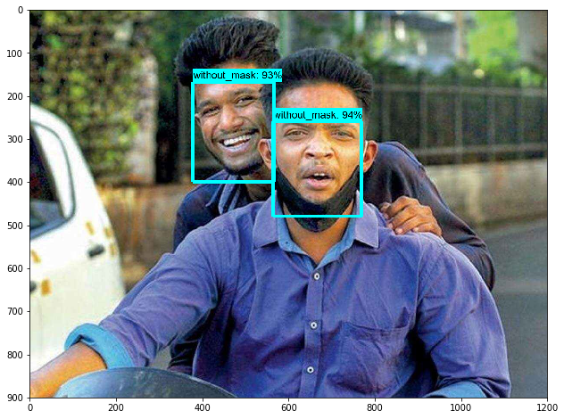
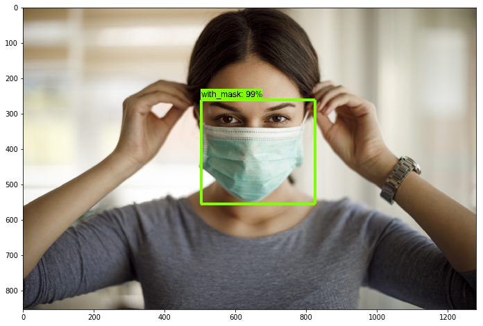

# Face Mask-detection-on-TensorflowAPI

## Introduction

This guide provide step by step tutorial How to set up Real Time Face-Mask detection on Tensorflow API

1. Evaluation on Pretrained model
    
	a) Dowanload pretrained model(SSDMobilenet_v2_COCO) from [here](https://drive.google.com/drive/folders/16PJcq719mP1uOxxNaQITKz-HwlH81xRY?usp=sharing) and copy to the object detection folder
	
	I am using Tensorflow API previous model which is may be unavaliable now, So kindly download it from my source 
	
	b) Download Tensorflow API Previous version form [here](https://drive.google.com/drive/folders/1EDlgKsEbg53SgyvOkmgn48PI0HLmBvUO?usp=sharing)
	
	c) If you are using Tensorflow 2.0 then please degrade it with TF1.X or make a new Environment by typing 
	              
			C:\> conda create -n tensorflow1 pip python=3.5
			
	Then, activate the environment
	           
			C:\> activate tensorflow1
	Install tensorflow-gpu in this environment by issuing:
	      
			(tensorflow1) C:\> pip install --ignore-installed --upgrade tensorflow-gpu
			
	Install the other necessary packages by issuing the following commands:
	
	   (tensorflow1) C:\> conda install -c anaconda protobuf
       (tensorflow1) C:\> pip install pillow
       (tensorflow1) C:\> pip install lxml
       (tensorflow1) C:\> pip install Cython
       (tensorflow1) C:\> pip install contextlib2
       (tensorflow1) C:\> pip install jupyter
       (tensorflow1) C:\> pip install matplotlib
       (tensorflow1) C:\> pip install pandas
       (tensorflow1) C:\> pip install opencv-python
			 
   d) Download this repo and extract to object detection folder	
		 
   e) Test Mask_Detection_tutorial.ipynb by typing in command prompt
            
       (tensorflow1) C:\tensorflow1\models\research\object_detection> jupyter notebook object_detection_tutorial.ipynb
	
## Result
 
 

## All Images are taken from Internet for testing purpose
